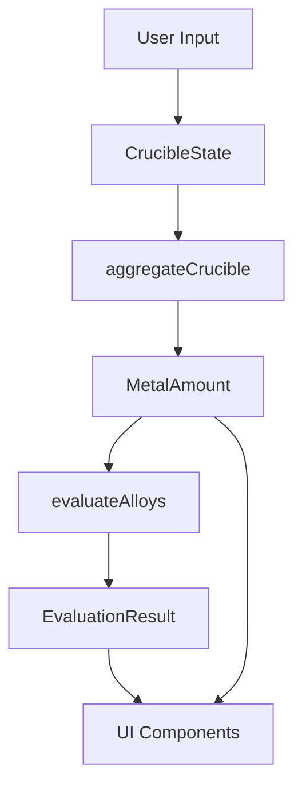

# Design Document

## Overview

The Vintage Story Alloy Calculator is a single-page React application built with Vite, TypeScript, Tailwind CSS, and shadcn/ui components. The application provides an interactive crucible simulator that validates metal compositions against known alloy recipes from Vintage Story. All computation happens client-side with no backend dependencies, making the application fully functional offline after initial load.

The architecture follows a clean separation between data models, business logic, and UI components. Alloy data is statically defined in TypeScript files (generated from Vintage Story Wiki sources), calculation logic is implemented as pure functions, and React components handle presentation and user interaction.

## Architecture

### High-Level Structure

```
src/
├── types/           # TypeScript type definitions
│   ├── alloys.ts    # Metal and alloy types
│   └── crucible.ts  # Crucible state types
├── data/            # Static data
│   └── alloys.ts    # Metal definitions and alloy recipes
├── lib/             # Business logic
│   └── alloyLogic.ts # Pure calculation functions
├── components/      # React UI components
│   ├── Header.tsx
│   ├── CrucibleSlotRow.tsx
│   ├── CruciblePanel.tsx
│   ├── CompositionCard.tsx
│   ├── ResultCard.tsx
│   └── AlloyReferenceTable.tsx
├── App.tsx          # Main application component
├── main.tsx         # Application entry point
└── index.css        # Global styles and Tailwind imports
```

### Technology Stack

- **Vite**: Build tool and dev server
- **React 18+**: UI framework using functional components and hooks
- **TypeScript**: Type-safe development with strict mode enabled
- **Tailwind CSS**: Utility-first styling with dark theme configuration
- **shadcn/ui**: Pre-built accessible components (Button, Card, Tabs, Select, Slider, Input, Label, Table, Tooltip, Alert, Badge)
- **Radix UI**: Headless UI primitives (via shadcn/ui)
- **lucide-react**: Icon library

### State Management

The application uses React's built-in state management:
- `useState` for crucible state in the root App component
- `useMemo` for derived calculations (composition aggregation, alloy evaluation)
- Props for passing data down the component tree
- No external state management libraries (Redux, Zustand, etc.)

### Data Flow



1. User modifies crucible slots via UI controls
2. State update triggers recalculation via `useMemo`
3. `aggregateCrucible` computes total amounts and percentages
4. `evaluateAlloys` matches composition against all recipes
5. Results flow to presentation components

## Components and Interfaces

### Type Definitions

#### src/types/alloys.ts

```typescript
export type MetalId =
  | "copper"
  | "tin"
  | "zinc"
  | "bismuth"
  | "gold"
  | "silver"
  | "lead"
  | "nickel";

export interface Metal {
  id: MetalId;
  label: string;           // Display name: "Copper"
  shortLabel: string;      // Abbreviation: "Cu"
  color: string;           // Tailwind color or hex for visualization
}

export interface AlloyComponent {
  metalId: MetalId;
  minPercent: number;      // Inclusive minimum (0-100)
  maxPercent: number;      // Inclusive maximum (0-100)
}

export interface AlloyRecipe {
  id: string;              // Unique identifier: "tin-bronze"
  name: string;            // Display name: "Tin Bronze"
  description?: string;    // Optional description
  components: AlloyComponent[];
  notes?: string;          // Additional information
  meltTempC?: number;      // Smelting temperature in Celsius
}
```

#### src/types/crucible.ts

```typescript
import type { MetalId } from "./alloys";

export interface CrucibleSlot {
  id: number;              // Slot index: 0-3
  metalId: MetalId | null; // null = empty slot
  nuggets: number;         // 0-128
}

export interface CrucibleState {
  slots: CrucibleSlot[];   // Always length 4
}
```

### Data Layer

#### src/data/alloys.ts

This file contains static data extracted from the Vintage Story Wiki:

```typescript
import type { Metal, AlloyRecipe } from "../types/alloys";

export const METALS: Metal[] = [
  {
    id: "copper",
    label: "Copper",
    shortLabel: "Cu",
    color: "#B87333" // Copper color
  },
  {
    id: "tin",
    label: "Tin",
    shortLabel: "Sn",
    color: "#C0C0C0" // Silver-gray
  },
  // ... other metals
];

export const ALLOY_RECIPES: AlloyRecipe[] = [
  {
    id: "tin-bronze",
    name: "Tin Bronze",
    components: [
      { metalId: "copper", minPercent: 88, maxPercent: 92 },
      { metalId: "tin", minPercent: 8, maxPercent: 12 }
    ],
    meltTempC: 950
  },
  {
    id: "brass",
    name: "Brass",
    components: [
      { metalId: "copper", minPercent: 60, maxPercent: 70 },
      { metalId: "zinc", minPercent: 30, maxPercent: 40 }
    ],
    meltTempC: 920
  },
  // ... other alloys (9 total)
];
```

**Alloy Data from Wiki:**

Based on the fetched wiki data, the complete alloy list:

1. **Tin Bronze**: 88-92% Copper, 8-12% Tin (950°C)
2. **Bismuth Bronze**: 50-70% Copper, 20-30% Zinc, 10-20% Bismuth (850°C)
3. **Black Bronze**: 68-84% Copper, 8-16% Silver, 8-16% Gold (1020°C)
4. **Brass**: 60-70% Copper, 30-40% Zinc (920°C)
5. **Molybdochalkos**: 8-12% Copper, 88-92% Lead (902°C)
6. **Lead Solder**: 45-55% Lead, 45-55% Tin (327°C)
7. **Silver Solder**: 40-50% Silver, 50-60% Tin (758°C)
8. **Cupronickel**: 65-75% Copper, 25-35% Nickel (1171°C)
9. **Electrum**: 40-60% Gold, 40-60% Silver (1010°C)

### Business Logic

#### src/lib/alloyLogic.ts

Pure functions for all calculations:

```typescript
import type { MetalId, AlloyRecipe } from "../data/alloys";
import type { CrucibleState } from "../types/crucible";

export interface MetalAmount {
  metalId: MetalId;
  nuggets: number;   // Sum across all slots
  units: number;     // nuggets * 5
  percent: number;   // 0-100
}

export interface AlloyViolation {
  metalId: MetalId;
  requiredMin?: number;
  requiredMax?: number;
  actual: number;
}

export interface AlloyMatchDetail {
  recipe: AlloyRecipe;
  isExact: boolean;
  score: number;
  violations: AlloyViolation[];
}

export interface EvaluationResult {
  amounts: MetalAmount[];
  totalNuggets: number;
  totalUnits: number;
  matches: AlloyMatchDetail[];
  bestMatch: AlloyMatchDetail | null;
}

/**
 * Aggregates crucible slots into per-metal totals with percentages
 */
export function aggregateCrucible(crucible: CrucibleState): MetalAmount[] {
  // Group by metalId, sum nuggets
  // Calculate units = nuggets * 5
  // Calculate percentages based on total units
  // Filter out metals with 0 units
}

/**
 * Evaluates composition against all alloy recipes
 */
export function evaluateAlloys(
  amounts: MetalAmount[],
  recipes: AlloyRecipe[]
): EvaluationResult {
  // For each recipe:
  //   - Check if all components are within range (with 0.2% tolerance)
  //   - Check for contamination (metals not in recipe > 0.5%)
  //   - Calculate deviation score (sum of absolute deviations)
  //   - Build violations list
  // Sort matches by isExact (true first), then by score (ascending)
  // Return bestMatch as first element or null
}

/**
 * Gets compatible metals for a given metal based on alloy recipes
 */
export function getCompatibleMetals(
  metalId: MetalId,
  recipes: AlloyRecipe[]
): MetalId[] {
  // Find all recipes containing the given metalId
  // Extract all other metalIds from those recipes
  // Return unique list of compatible metals
}

/**
 * Filters available metals based on currently selected metals in crucible
 */
export function getAvailableMetals(
  crucible: CrucibleState,
  allMetals: Metal[],
  recipes: AlloyRecipe[]
): Metal[] {
  // Get all non-null metalIds from crucible
  // If empty, return all metals
  // If one metal selected, return compatible metals
  // If multiple metals selected, return all metals
}

/**
 * Adjusts crucible slots to maintain alloy ratio when one slot changes
 */
export function adjustCrucibleForAlloy(
  crucible: CrucibleState,
  changedSlotId: number,
  targetRecipe: AlloyRecipe | null
): CrucibleState {
  // If no target recipe, return unchanged
  // Calculate new total based on changed slot's percentage in recipe
  // Distribute remaining nuggets proportionally across other slots
  // Clamp each slot to 0-128 range
  // Return adjusted crucible state
}

/**
 * Detects which alloy recipe the current crucible matches (for tracking preset state)
 */
export function detectCurrentAlloy(
  crucible: CrucibleState,
  recipes: AlloyRecipe[]
): AlloyRecipe | null {
  // Aggregate crucible
  // Find exact match with tolerance
  // Return matching recipe or null
}

/**
 * Helper: Check if value is within range with tolerance
 */
export function isWithinRange(
  value: number,
  min: number,
  max: number,
  tolerance: number = 0.2
): boolean {
  return value >= min - tolerance && value <= max + tolerance;
}

/**
 * Helper: Clamp value between min and max
 */
export function clamp(value: number, min: number, max: number): number {
  return Math.max(min, Math.min(max, value));
}

/**
 * Creates an empty crucible state
 */
export function createEmptyCrucible(): CrucibleState {
  return {
    slots: [
      { id: 0, metalId: null, nuggets: 0 },
      { id: 1, metalId: null, nuggets: 0 },
      { id: 2, metalId: null, nuggets: 0 },
      { id: 3, metalId: null, nuggets: 0 }
    ]
  };
}

/**
 * Creates a preset crucible for a given alloy recipe (minimum 1 ingot = 20 nuggets)
 */
export function createPresetForAlloy(recipe: AlloyRecipe): CrucibleState {
  // Calculate midpoint percentages for each component
  // Scale to 20 nuggets minimum total
  // Distribute across slots (one metal per slot)
  // Round to integers while maintaining ratios
}
```

### UI Components

#### Header.tsx

Simple header with title and description:

```typescript
export function Header() {
  return (
    <header className="border-b border-border bg-card">
      <div className="container mx-auto px-4 py-6">
        <h1 className="text-3xl font-bold">Vintage Story Alloy Calculator</h1>
        <p className="text-muted-foreground mt-2">
          Calculate valid alloy compositions for your crucible.
          Alloy data sourced from the Vintage Story Wiki.
        </p>
      </div>
    </header>
  );
}
```

#### CrucibleSlotRow.tsx

Individual slot input with metal selector and nugget controls:

```typescript
interface CrucibleSlotRowProps {
  slot: CrucibleSlot;
  availableMetals: Metal[];
  onChange: (slotId: number, patch: Partial<CrucibleSlot>) => void;
  onNuggetChange?: (slotId: number, nuggets: number) => void; // Special handler for ratio adjustment
}

export function CrucibleSlotRow({ slot, availableMetals, onChange, onNuggetChange }: CrucibleSlotRowProps) {
  // Renders:
  // - Label: "Slot 1"
  // - Select dropdown for metal (with "Empty slot" option, filtered by availableMetals)
  // - Slider (0-128) for nuggets
  // - Number input (0-128) for nuggets
  // - Display: "X nuggets (Y units)"
  // Uses shadcn Select, Slider, Input, Label components
  // Calls onNuggetChange when nugget amount changes (for ratio adjustment)
}
```

#### CruciblePanel.tsx

Container for all four slots with action buttons:

```typescript
interface CruciblePanelProps {
  crucible: CrucibleState;
  onCrucibleChange: (crucible: CrucibleState) => void;
  allMetals: Metal[];
  recipes: AlloyRecipe[];
}

export function CruciblePanel({ crucible, onCrucibleChange, allMetals, recipes }: CruciblePanelProps) {
  // State: currentAlloy (tracks loaded preset for ratio adjustment)

  // Renders:
  // - Card with title "Crucible Inputs"
  // - Four CrucibleSlotRow components with filtered availableMetals
  // - Button: "Clear Crucible"
  // - Preset buttons for all 9 alloys (grid layout)
  // Uses shadcn Card, Button components

  // Handlers:
  // - handlePresetClick: loads preset and sets currentAlloy
  // - handleNuggetChange: adjusts other slots if currentAlloy is set
  // - handleMetalChange: clears currentAlloy (manual mode)
}
```

#### CompositionCard.tsx

Displays aggregated metal composition:

```typescript
interface CompositionCardProps {
  amounts: MetalAmount[];
  totalNuggets: number;
  totalUnits: number;
}

export function CompositionCard({ amounts, totalNuggets, totalUnits }: CompositionCardProps) {
  // Renders:
  // - Card with title "Current Composition"
  // - Total nuggets and units
  // - List of metals with color dot, name, nuggets, units, percentage
  // - Horizontal stacked bar chart (flex container with colored divs)
  // - Empty state if totalUnits === 0
  // Uses shadcn Card, Badge components
}
```

#### ResultCard.tsx

Displays alloy evaluation results:

```typescript
interface ResultCardProps {
  evaluation: EvaluationResult;
}

export function ResultCard({ evaluation }: ResultCardProps) {
  // Renders different states:
  // 1. Empty state (totalUnits === 0): Info message
  // 2. Exact match (bestMatch.isExact === true): Success state with alloy name, badge, table
  // 3. Close match (bestMatch exists but not exact): Warning state with deviations
  // 4. No match: Error state
  // Uses shadcn Card, Badge, Alert, Table components
}
```

#### AlloyReferenceTable.tsx

Reference table of all alloys:

```typescript
interface AlloyReferenceTableProps {
  recipes: AlloyRecipe[];
}

export function AlloyReferenceTable({ recipes }: AlloyReferenceTableProps) {
  // Renders:
  // - Card with title "Alloy Reference"
  // - Table with columns: Alloy Name, Components, Smelting Temp, Notes
  // - Each component shows "Metal: min-max%"
  // Uses shadcn Card, Table components
}
```

### Main Application

#### App.tsx

Root component orchestrating all pieces with vertical layout:

```typescript
import { useState, useMemo } from "react";
import { Tabs, TabsContent, TabsList, TabsTrigger } from "@/components/ui/tabs";
import { METALS, ALLOY_RECIPES } from "./data/alloys";
import { aggregateCrucible, evaluateAlloys, createEmptyCrucible } from "./lib/alloyLogic";
import { Header } from "./components/Header";
import { CruciblePanel } from "./components/CruciblePanel";
import { CompositionCard } from "./components/CompositionCard";
import { ResultCard } from "./components/ResultCard";
import { AlloyReferenceTable } from "./components/AlloyReferenceTable";

export function App() {
  const [crucible, setCrucible] = useState(createEmptyCrucible());

  const amounts = useMemo(
    () => aggregateCrucible(crucible),
    [crucible]
  );

  const evaluation = useMemo(
    () => evaluateAlloys(amounts, ALLOY_RECIPES),
    [amounts]
  );

  return (
    <div className="min-h-screen bg-background text-foreground">
      <Header />
      <main className="container mx-auto px-4 py-6">
        <Tabs defaultValue="calculator">
          <TabsList>
            <TabsTrigger value="calculator">Calculator</TabsTrigger>
            <TabsTrigger value="reference">Alloy Reference</TabsTrigger>
          </TabsList>

          <TabsContent value="calculator">
            {/* Vertical stacking layout for better 1080p fit */}
            <div className="space-y-6">
              <CruciblePanel
                crucible={crucible}
                onCrucibleChange={setCrucible}
                allMetals={METALS}
                recipes={ALLOY_RECIPES}
              />
              <div className="grid gap-6 md:grid-cols-2">
                <CompositionCard
                  amounts={evaluation.amounts}
                  totalNuggets={evaluation.totalNuggets}
                  totalUnits={evaluation.totalUnits}
                />
                <ResultCard evaluation={evaluation} />
              </div>
            </div>
          </TabsContent>

          <TabsContent value="reference">
            <AlloyReferenceTable recipes={ALLOY_RECIPES} />
          </TabsContent>
        </Tabs>
      </main>
    </div>
  );
}
```

## Data Models

### Crucible Constraints

- 4 slots total (fixed)
- Each slot: 0-128 nuggets (integer)
- Each nugget = 5 units of metal
- Maximum capacity: 512 nuggets = 2560 units
- Each slot holds only one metal type

### Alloy Matching Algorithm

1. **Aggregate metals**: Sum nuggets across all slots by metal type
2. **Calculate percentages**: `percent = (metalUnits / totalUnits) * 100`
3. **For each recipe**:
   - Check all required components are within range (with 0.2% tolerance)
   - Check for contamination (non-recipe metals > 0.5%)
   - Calculate score: sum of `|actual - midpoint|` for each component
   - Mark as exact if no violations
4. **Sort matches**: Exact matches first, then by ascending score
5. **Return best match**: First in sorted list

### Preset Compositions

All nine alloy presets calculated to produce at least 1 ingot (20 nuggets minimum) using midpoint percentages:

1. **Tin Bronze**: 18 Cu (90%), 2 Sn (10%) = 20 nuggets
2. **Bismuth Bronze**: 12 Cu (60%), 5 Zn (25%), 3 Bi (15%) = 20 nuggets
3. **Black Bronze**: 15 Cu (76%), 2.5 Ag (12%), 2.5 Au (12%) = 20 nuggets (rounded: 15 Cu, 3 Ag, 2 Au)
4. **Brass**: 13 Cu (65%), 7 Zn (35%) = 20 nuggets
5. **Molybdochalkos**: 2 Cu (10%), 18 Pb (90%) = 20 nuggets
6. **Lead Solder**: 10 Pb (50%), 10 Sn (50%) = 20 nuggets
7. **Silver Solder**: 9 Ag (45%), 11 Sn (55%) = 20 nuggets
8. **Cupronickel**: 14 Cu (70%), 6 Ni (30%) = 20 nuggets
9. **Electrum**: 10 Au (50%), 10 Ag (50%) = 20 nuggets

### Compatible Metal Filtering

When a single metal is selected in any slot, the application filters available metals in other empty slots to show only compatible combinations:

**Metal Compatibility Matrix:**
- **Copper**: Compatible with Tin, Zinc, Bismuth, Gold, Silver, Nickel, Lead
- **Tin**: Compatible with Copper, Lead, Silver
- **Zinc**: Compatible with Copper, Bismuth
- **Bismuth**: Compatible with Copper, Zinc
- **Gold**: Compatible with Copper, Silver
- **Silver**: Compatible with Copper, Gold, Tin
- **Lead**: Compatible with Copper, Tin
- **Nickel**: Compatible with Copper

This matrix is derived from the alloy recipes where each metal pair appears together in at least one valid alloy.

### Dynamic Alloy Ratio Adjustment

When a preset is loaded and the user modifies a slot's nugget amount, the application automatically adjusts other slots to maintain the closest valid alloy ratio:

**Adjustment Algorithm:**
1. Identify the currently loaded preset/alloy (track via state or detect from current composition)
2. When a slot changes, calculate the new target total based on the modified slot's percentage in the recipe
3. Distribute the remaining nuggets across other slots proportionally to maintain recipe ratios
4. Apply constraints: each slot 0-128 nuggets, total must stay within valid alloy ranges
5. If constraints cannot be satisfied, allow invalid state and show feedback

**Example:** User loads Brass preset (13 Cu, 7 Zn). User changes Cu from 13 to 26 nuggets:
- New total target: 26 / 0.65 ≈ 40 nuggets
- Zn should be: 40 × 0.35 = 14 nuggets
- Result: 26 Cu, 14 Zn (still valid Brass at 65%/35%)

## Error Handling

### Input Validation

- Nugget inputs clamped to 0-128 range
- Non-integer inputs rounded to nearest integer
- Invalid metal selections default to null (empty)

### Calculation Edge Cases

- Empty crucible (totalUnits = 0): Display empty state, skip evaluation
- Single metal: No alloy match, show "no known alloy" message
- Rounding errors: Use 0.2% tolerance for percentage comparisons
- Contamination: Metals not in recipe treated as invalid if > 0.5%

### UI Error States

- No errors thrown to user; all states handled gracefully
- Empty states for zero data
- Warning states for close but invalid matches
- Error states for no matches

## Testing Strategy

### Unit Tests (Optional)

Focus on core calculation logic:

- `aggregateCrucible`: Test with various slot configurations
- `evaluateAlloys`: Test exact matches, close matches, no matches
- `isWithinRange`: Test boundary conditions with tolerance
- Edge cases: empty crucible, single metal, contamination

### Manual Testing

Primary testing approach:

1. **Crucible interactions**: Add/remove metals, adjust nuggets
2. **Alloy validation**: Test known valid recipes from wiki
3. **Responsive layout**: Test on mobile and desktop viewports
4. **Accessibility**: Keyboard navigation, screen reader compatibility
5. **Preset buttons**: Verify presets produce valid alloys
6. **Reference table**: Verify all 9 alloys displayed correctly

### Integration Testing (Optional)

- Full user flows: empty → add metals → see results
- Tab switching between calculator and reference
- State persistence during interactions

## Performance Considerations

### Optimization Strategies

- `useMemo` for expensive calculations (aggregation, evaluation)
- Pure functions enable memoization
- Static alloy data (no fetching after initial load)
- Minimal re-renders via proper React key usage

### Expected Performance

- Calculation time: < 10ms for all operations
- UI update latency: < 100ms (requirement: < 100ms)
- Initial load: < 2s on 3G connection
- Bundle size target: < 500KB (gzipped)

## Accessibility

### WCAG AA Compliance

- Color contrast ratios ≥ 4.5:1 for text
- Focus indicators on all interactive elements
- Semantic HTML (proper heading hierarchy, landmarks)
- ARIA labels for icon buttons and complex widgets
- Keyboard navigation for all functionality

### Screen Reader Support

- Descriptive labels for all form controls
- Live regions for dynamic result updates
- Table headers for reference table
- Alternative text for visual indicators

## Styling and Theming

### Tailwind Configuration

```javascript
// tailwind.config.js
export default {
  darkMode: "class",
  content: [
    "./index.html",
    "./src/**/*.{ts,tsx,js,jsx}",
  ],
  theme: {
    extend: {
      colors: {
        // shadcn/ui color tokens
        border: "hsl(var(--border))",
        background: "hsl(var(--background))",
        foreground: "hsl(var(--foreground))",
        // ... other tokens
      }
    }
  }
}
```

### Dark Theme

- Default theme: dark with teal/blue accent
- Background: dark gray (#0a0a0a)
- Cards: slightly lighter gray (#1a1a1a)
- Text: light gray (#e5e5e5)
- Accent: teal (#14b8a6) or blue (#3b82f6)
- Borders: subtle gray (#27272a)

### Component Styling

- Cards: rounded corners, subtle shadows, padding
- Buttons: hover states, active states, disabled states
- Inputs: focus rings, validation states
- Tables: alternating row colors, hover highlights
- Badges: colored backgrounds for status (success, warning, error)

## Deployment

### Build Process

```bash
pnpm install
pnpm run build
```

Output: `dist/` directory with static files

### Hosting Options

- Static hosting (Vercel, Netlify, GitHub Pages)
- No server-side requirements
- No environment variables needed
- No API keys or secrets

### Browser Support

- Modern browsers (Chrome, Firefox, Safari, Edge)
- ES2020+ JavaScript features
- CSS Grid and Flexbox
- No IE11 support required
